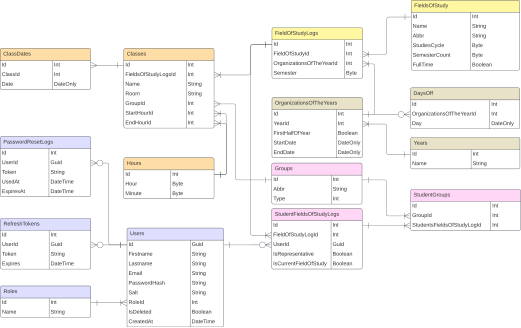

# eUNI Backend Documentation

## Overview

The backend of the eUNI application is responsible for secure data management, business logic processing, and API service delivery for a student scheduling web platform. It is implemented in C# using ASP.NET Core 8 and follows a multi-layered N-Layer architecture.

## Backend Architecture

The backend is divided into three core layers (N-Layered Architecture):

- User Interface Layer - contains controllers that expose REST API endpoints. Responsible for receiving HTTP requests and returning responses.
- Business Logic Layer (BLL) - contains services that handle business rules and data processing. Acts as an intermediary between UI and data access layers.
- Data Access Layer (DAL) - uses Entity Framework Core (EF Core) for ORM. Handles CRUD operations and database interactions.

## Folder Structure (Backend)

- `eUNI-API/`
  - `Attributes/` – Custom attributes (e.g., role-based auth)
  - `Configuration/` – JWT and other config settings
  - `Controllers/` – API endpoints
  - `Data/` – EF Core DB context and migrations
  - `Enums/` – Constant definitions
  - `Exception/` – Custom exceptions
  - `Helpers/` – Shared utility methods
  - `Middlewares/` – Global error handling logic
  - `Models/DTOs` & `Models/Entities` – Data transfer and DB models
  - `Repositories/` – Data layer access logic
  - `Services/` – Business logic implementations
  - `Program.cs` – Entry point and API bootstrapping
  - `appsettings.json` – Environment-based configurations

## Security

### Authentication & Authorization

Tokens are transmitted via HTTP headers and cookies to ensure secure session management. The application uses:

- JWT (JSON Web Token) - for stateless authentication.
- Refresh Token - stored in HTTP-only cookies, used to renew JWTs.

The default expiration time for tokens is:

- JWT: **15 minutes**
- Refresh Token: **3 days**

### Password Handling

Passwords are hashed using `bcrypt` with added salt on frontend. Next the server-side app uses hashing utilizes `PBKDF2` to mitigate brute-force attacks.

## Database (PostgreSQL)

### User Entities

- _Users_: Stores credentials, role, and hashed passwords
- _Roles_: Role-based access control
- _RefreshTokens_: Stores refresh tokens for session extension
- _PasswordResetLogs_: For password recovery

### Academic Structure

- _Classes, ClassDates, Hours_ - Handle scheduling
- _FieldOfStudy, FieldOfStudyLogs_ - Degree programs
- _StudentGroups, Groups_ - Student cohorts
- _OrganizationOfTheYear, DaysOff, Years_ - Academic calendar



## API Design

The backend supports role-based access via JWT claims. RESTful APIs provide endpoints for:

- User registration & login
- Profile & schedule management
- _Admin features_: course/year management, user roles

## External Integration

`Ical.Net` library is used to generate iCalendar-compatible files. Schedule exports to Google Calendar or Outlook are supported.

## Error Handling

A global middleware component captures unhandled exceptions and returns standardized JSON responses with the appropriate HTTP status codes (e.g., `400`, `403`, `500`). To support this mechanism, custom exception classes were implemented to handle specific error types, including:

- HttpBadRequestException
- HttpUnauthorizedException
- HttpForbiddenException
- HttpNotFoundException
- HttpCustomException

## Configuration

1. Copy `.env.example` to `.env`.

```bash
cp .env.example .env
```

2. Create a secure key for the `JWT__Key` environment variable using the following command.

```bash
node -e "console.log(require('crypto').randomBytes(256).toString('hex'));"
```

3. Configure CORS by specifing the frontend adress in `AllowedOrigins`.

# Development

When `ASPNETCORE_ENVIRONMENT` is set to `Development` in the `.env` file, the Swagger UI is available at [http://localhost:5000/swagger](http://localhost:5000/swagger)

# Demo version

A live demo of the app is hosted at: [api-euni.jakubniewelt.pl](https://api-euni.jakubniewelt.pl)

**_NOTE: Deployment handled via Coolify with GitHub Actions integration for automated CI/CD._**

